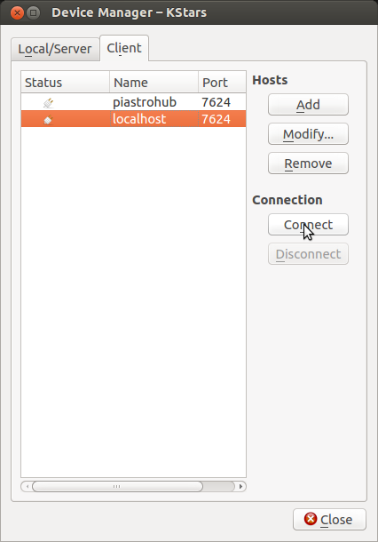
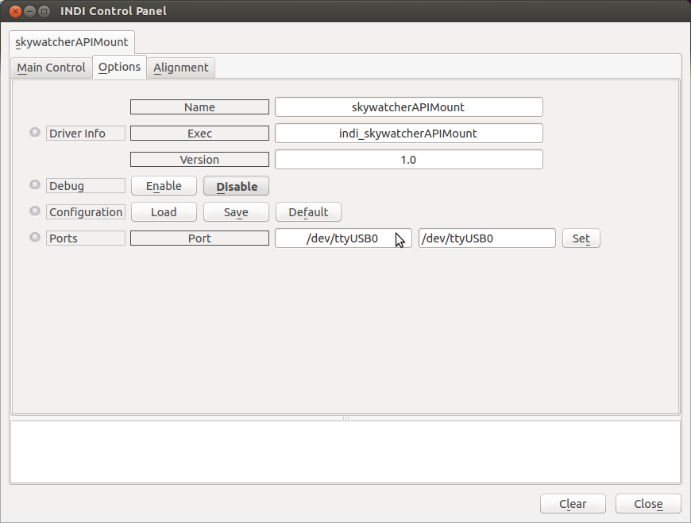
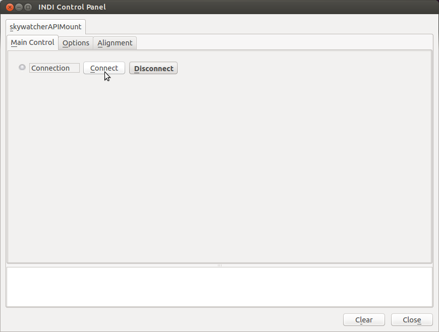
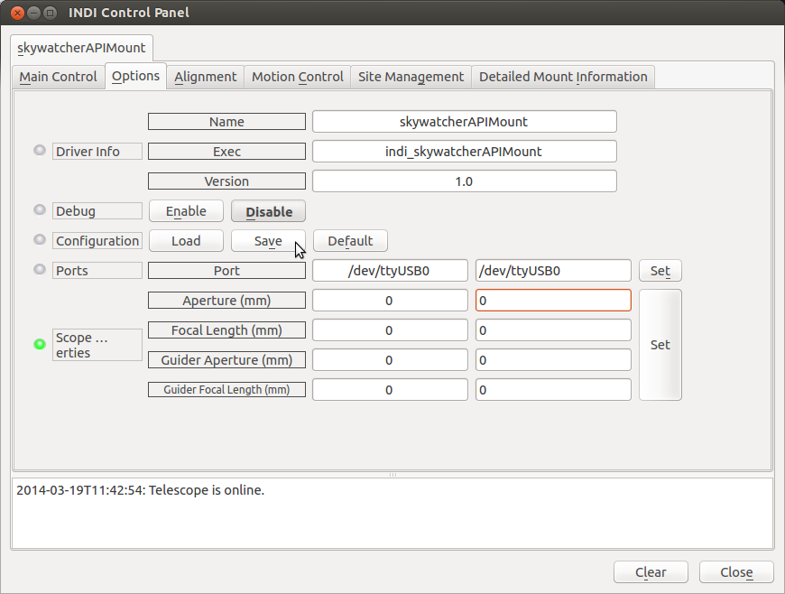
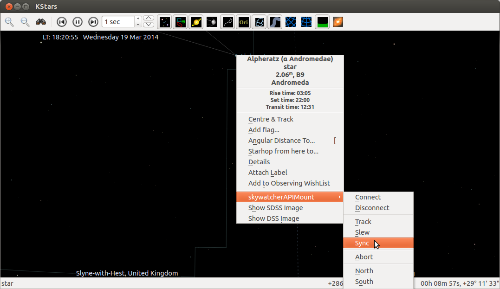
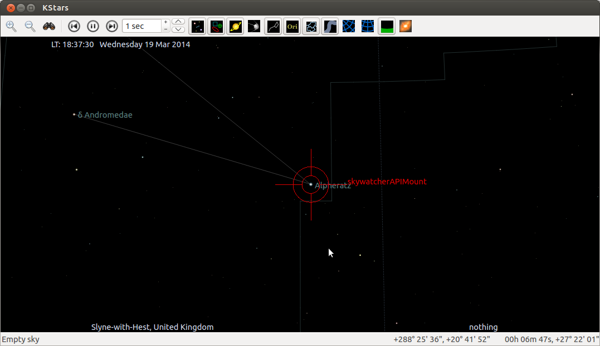

# INDI Alignment Subsystem

## Introduction
The INDI alignment subsystem is a collection of classes that together provide support for telescope alignment using a database of stored sync points. Support is also provided for "Math Plugin Modules". One of these runtime loadable modules is active at any one time. The currently loaded module uses the sync point database to provide conversion functions to and from coordinates in the celestial reference frame and the telescope mount's local reference frame.

During observing runs the sync point database is held in memory within the INDI device driver. It can also be loaded and saved to and from a file on the system the driver is running. The database can be edited via INDI properties (for details of the properties see the class MapPropertiesToInMemoryDatabase), by an API class for use in INDI drivers(InMemoryDatabase), or an API class for use in INDI clients(ClientAPIForAlignmentDatabase).

The current math plugin module can be selected and initialised via INDI properties (for details of the properties see the class MathPluginManagement), or by an API class for use in INDI clients(ClientAPIForMathPluginManagement).

## Math Plugins
The following math plugins are included in the first release.

### Built in math plugin
This is the default plugin which is used if no other plugin has been loaded. The plugin is normally initialised or re-initialised when the database has been loaded or when a new sync point has been added. The initialisation process scans the current database and build a number of transformation matrices depending on how many sync points are present. Before the matrices are computed all celestial reference frame Right Ascension and Declination coordinates are transformed to horizontal Altitude Azimuth coordinates using the julian date stored in the sync point entry. This means that all transformations using the computed transformation matrices will be to and from a zenith aligned celestial reference frame and the telescope mounts local reference frame. This has the advantage of incorporating any systematic alignment errors which occur due to the direction the mount is pointing relative to the zenith in the transformation. Examples of such errors include those due to atmospheric refraction, and those due the effect of gravity on the telescope and mount. All transformation matrices are computed using the simple method proposed by Taki. This is quick and dirty but can result in matrices that are not true transforms. These will be reported as errors and an identity matrix will be substituted.

#### No sync points present

No action is taken. 

#### One sync point present

A transformation matrix is computed using a hint to mounts approximate alignment supplied by the driver, this can either be ZENITH, NORTH_CELESTIAL_POLE or SOUTH_CELESTIAL_POLE. The hint is used to make a dummy second sync point entry. A dummy third entry is computed from the cross product of the first two. A single transformation matrix and it is inverse is computed from these three points. 

#### Two sync points present

A transformation matrix is computed using the two sync points and a dummy third sync point computed from the cross product of the first two. A single transformation matrix and it is inverse is computed from these three points.

#### Three sync points present

A single transformation matrix and it is inverse is computed from the three sync points.

#### Four or more sync points present

Two convex hulls are computed. One from the zenith aligned celestial reference frame sync point coordinates plus a dummy nadir, and the other from the mounts local reference frame sync point coordinates plus a dummy nadir. These convex hulls are made up of triangular facets. Forward and inverse transformation matrices are then computed for each corresponding pair of facets and stored alongside the facet in the relevant convex hull.

When the plugin is asked to translate a coordinate if it only has single conversion matrices (the one, two and three sync points case) these will be used. Otherwise (the four or more sync points case) a ray will shot from the origin of the requested source reference frame in the requested direction into the relevant convex hull and the transformation matrices from the facet it intersects will be used for the conversion.

### SVD math plugin
This plugin works in an identical manner to the built in math plugin. The only difference being that Markley's Singular Value Decomposition algorithm is used to calculate the transformation matrices. This is a highly robust method and forms the basis of the pointing system used in many professional telescope installations.

## Using the Alignment Subsystem from KStars
The easiest way to use a telescope driver that supports the Alignment Subsystem is via an INDI aware client such as KStars. The following example uses the indi_SkywatcherAPIMount driver and a Synscan 114GT mount. If you are using a different driver then the name of that driver will appear in KStars not "skywatcherAPIMount".

1. Firstly connect the mount to the computer that is to run the driver. I use a readily available PL2303 chip based serial to USB converter cable.
2. From the handset utility menu select PC direct mode. As it is the computer that will be driving the mount not the handset, you can enter whatever values you want to get through the handset initialisation process.
3. Start indiserver and the indi_SkyWatcherAPIMount driver. Using the following command in a terminal:

        indiserver -vvv indi_skywatcherAPIMount

4. Start KStars and from the tools menu select "Devices" and then "Device Manager".

5. In the device manager window select the "Client" tab, and in the client tab select the host that indiserver is running on. Click on connect.

6. An INDI Control Panel window should open with a skywatcherAPIMount tab. Select the "Options" subtab (I think I have invented this word!). Ensure that the port property is set to the correct serial device. My PL2303 usb cable always appears as /dev/ttyUSB0.

7. Select the "Main Control" tab and click on connect.

8. After a few seconds pause (whilst the driver determines what type of motor board is in use) a number of extra tabs should appear. One of these should be the "Site Management" tab. Select this and ensure that you have correct values entered for "Scope Location", you can safely ignore elevation at this time.

9. At this point it is probably wise to save the configuration. Return to "Options" tab and click on "Configuration" "Save".

10. Check that the "Alignment" tab is present and select it. Using the controls on this tab you can view and manipulate the entries in the alignment database, and select which math plugin you want to use. It probably best to ignore this tab for the time being and use KStars to create sync points and align your mount.

11. To create a sync point using KStars. First ensure your target star is visible in the KStars display. I usually do this using the "Pointing...Find Object" tool.

12. Once you have the target in the KStars window right click on it and then hover your mouse over the "Sync" option in the "skywatcherAPIMount" sub-menu. N.B. The "Centre and Track" item in the main popup menu are nothing to do with your mount. They merely tell KStars to keep this object centered in the display window. Do not left click on the "Sync" option yet.

13. Go back to your scope and centre the target in the eyepiece. Quickly get back to your computer and left click the mouse (be careful not to move it off the Sync menu item or you will have to right click to bring it up again). If you have been successful you should see the KStars telescope crosshairs displayed around the target.
.

14. The Alignment Subsystem is now in "one star" alignment mode. You can try this out by right clicking on your target star or a nearby star and selecting "Track" from the "skywatcherAPIMount" sub-menu. The further away the object you track is from the target star the less accurate the initial slew will be and the more quickly the tracked star will drift off centre. To correct this you need to add more sync points.

15. To add another sync point you can select a new target star and use the slew command from the "skywatcherAPIMount" sub-menu to approximately slew your scope onto the target. The procedure for adding the sync point is the same as before. With the default math plugin you achieve the maximum accuracy for a particular triangular patch of sky when it is defined by three sync points. If more than three sync points are defined then more triangular patches will be added to the mesh.

16. If would be very useful if you could collect information on how well the alignment mechanism holds a star centered, measured in degrees of drift per second. Please share these on the indi-devel list.

## Adding Alignment Subsystem support to an INDI driver
TBD

## Developing Alignment Subsystem clients
The Alignment Subsystem provides two API classes for use in clients. These are ClientAPIForAlignmentDatabase and ClientAPIForMathPluginManagement. Client developers can use these classes individually, however, the easiest way to use them is via the AlignmentSubsystemForClients class. To use this class simply ensure that is a parent of your client class.

	class LoaderClient : public INDI::BaseClient, INDI::AlignmentSubsystem::AlignmentSubsystemForClients

Somewhere in the initialisation of your client make a call to the Initalise method of the AlignmentSubsystemForClients class for example:

    void LoaderClient::Initialise(int argc, char* argv[])
    {
        std::string HostName("localhost");
        int Port = 7624;

        if (argc > 1)
            DeviceName = argv[1];
        if (argc > 2)
            HostName = argv[2];
        if (argc > 3)
        {
            std::istringstream Parameter(argv[3]);
            Parameter >> Port;
        }

        AlignmentSubsystemForClients::Initialise(DeviceName.c_str(), this);

        setServer(HostName.c_str(), Port);

        watchDevice(DeviceName.c_str());

        connectServer();

        setBLOBMode(B_ALSO, DeviceName.c_str(), NULL);
    }

To hook the Alignment Subsystem into the clients property handling you must ensure that the following virtual functions are overriden.

    virtual void newBLOB(IBLOB *bp);
    virtual void newDevice(INDI::BaseDevice *dp);
    virtual void newNumber(INumberVectorProperty *nvp);
    virtual void newProperty(INDI::Property *property);
    virtual void newSwitch(ISwitchVectorProperty *svp);

A call to the Alignment Subsystems property handling functions must then be placed in the body of these functions.

    void LoaderClient::newBLOB(IBLOB *bp)
    {
        ProcessNewBLOB(bp);
    }

    void LoaderClient::newDevice(INDI::BaseDevice *dp)
    {
        ProcessNewDevice(dp);
    }

    void LoaderClient::newNumber(INumberVectorProperty *nvp)
    {
        ProcessNewNumber(nvp);
    }

    void LoaderClient::newProperty(INDI::Property *property)
    {
        ProcessNewProperty(property);
    }

    void LoaderClient::newSwitch(ISwitchVectorProperty *svp)
    {
        ProcessNewSwitch(svp);
    }

See the documentation for the ClientAPIForAlignmentDatabase and ClientAPIForMathPluginManagement to see what other functionality is available.